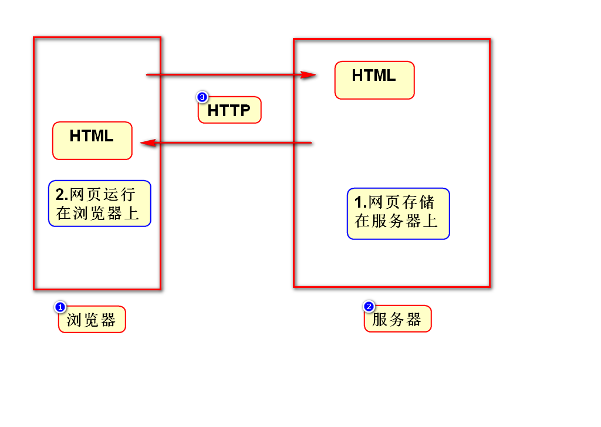
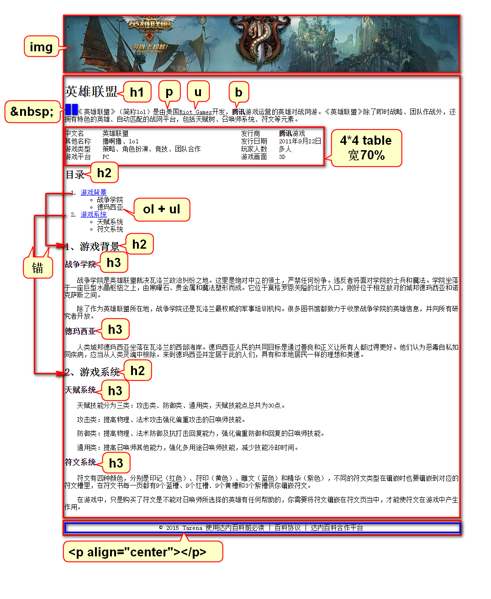

李洪鹤/lihh@tedu.cn

# 一、Java知识体系结构

# 二、课程介绍
## 1.HTML(1.5天)
- 勾勒出网页的结构和内容

## 2.CSS(3天)
- 美化网页

## 3.JavaScript(4天)
- 让网页呈现动态的数据和效果

## 4.jQuery(1.5天)
- 框架，提高JS的开发效率

# 三、HTML
## 1.原理

## 2.XML和HTML的联系
### XML
- 可扩展标签语言：标签、属性、嵌套关系可以扩展
- 用来存储或传输数据

### HTML
- 超文本标签语言：语法固定(w3c)
- 用来显示数据
- 某些特定版本的HTML就严格满足XML语法规范
- 可以将HTML理解成标签固定的XML

# 四、表格

# 五、英雄联盟-百度百科案例
1. 将网页分为3个区域(div)
2. 将3个区域的宽设置为960，并让他们居中

	style="border:1px solid red;width:960px;margin:0 auto;"

3. 逐个区域写标签

# 补充
## 1.w3c中文官方网站
- www.w3school.com.cn
- doc.tedu.cn(达内文档服务器，由苍老师整理)

## 2.创建WEB项目注意事项
- 在JavaEE视图下开发WEB项目(Eclipse右上角)
- 创建项目时要选择packaging为war
- 右键点击deployment，选择Generate ...

## 3.关于上传代码
- 看day0n.html
- 该笔记包含了内容和代码、是对PPT的补充
- 每次上传的代码会涵盖当前之前的所有内容

